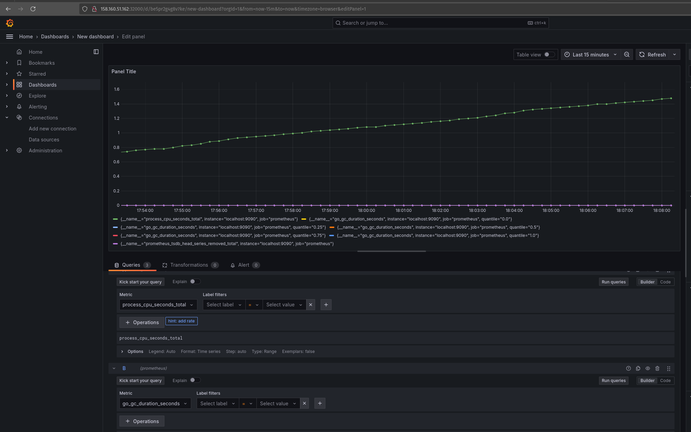

# YC Managed Kubernetes


## Создание кластера Managed Service for Kubernetes

```
yc managed-kubernetes cluster create \
--network-name default \
--zone ru-central1-a \
--subnet-name default-ru-central1-a \
--public-ip \
--service-account-id aje04s2i437pqvk9ti0d \
--node-service-account-id aje04s2i437pqvk9ti0d \
--cluster-ipv4-range 10.3.0.0/20 \
--service-ipv4-range 10.0.3.0/24
```


## Создание группы узлов Managed Service for Kubernetes

```
yc managed-kubernetes node-group create \
--name k8s-dkazanskii-ng \
--cluster-id cat3jbqrplkjp2snrfff \
--platform standard-v3 \
--cores 2 --memory 4 --core-fraction 20 \
--disk-type network-ssd --network-interface subnets=default-ru-central1-a,ipv4-address=nat \
--async \
--auto-scale max=4
```


## Grafana GUI

  


## Приложение 2. `k8s-cluster.yaml` - конфигурационный файл развертывания кластера средствами `k8s`

  ```
# Namespace
apiVersion: v1
kind: Namespace
metadata:
  name: monitoring
---
# ConfigMap для SQL-инициализации PostgreSQL
apiVersion: v1
kind: ConfigMap
metadata:
  name: postgres-init-sql
  namespace: monitoring
data:
  init.sql: |
    CREATE TABLE IF NOT EXISTS users (
        id SERIAL PRIMARY KEY,
        username VARCHAR(50) NOT NULL,
        email VARCHAR(100) NOT NULL UNIQUE,
        created_at TIMESTAMP DEFAULT CURRENT_TIMESTAMP
    );

    INSERT INTO users (username, email)
    SELECT 
        'user_' || generate_series(1, 100) AS username,
        'user_' || generate_series(1, 100) || '@example.com' AS email;
---
# StatefulSet для PostgreSQL
apiVersion: apps/v1
kind: StatefulSet
metadata:
  name: postgres
  namespace: monitoring
spec:
  serviceName: postgres
  replicas: 1
  selector:
    matchLabels:
      app: postgres
  template:
    metadata:
      labels:
        app: postgres
    spec:
      containers:
      - name: postgres
        image: postgres:15
        ports:
        - containerPort: 5432
        env:
        - name: POSTGRES_USER
          value: admin
        - name: POSTGRES_PASSWORD
          value: admin
        - name: POSTGRES_DB
          value: example_db
        volumeMounts:
        - name: postgres-data
          mountPath: /var/lib/postgresql/data
        - name: init-sql
          mountPath: /docker-entrypoint-initdb.d
      volumes:
      - name: init-sql
        configMap:
          name: postgres-init-sql
  volumeClaimTemplates:
  - metadata:
      name: postgres-data
    spec:
      accessModes: ["ReadWriteOnce"]
      resources:
        requests:
          storage: 10Gi
---
# Service для PostgreSQL
apiVersion: v1
kind: Service
metadata:
  name: postgres
  namespace: monitoring
spec:
  ports:
    - port: 5432
      targetPort: 5432
  selector:
    app: postgres
---
# Deployment для Zookeeper
apiVersion: apps/v1
kind: Deployment
metadata:
  name: zookeeper
  namespace: monitoring
spec:
  replicas: 1
  selector:
    matchLabels:
      app: zookeeper
  template:
    metadata:
      labels:
        app: zookeeper
    spec:
      containers:
      - name: zookeeper
        image: confluentinc/cp-zookeeper:7.5.0
        ports:
        - containerPort: 2181
        env:
        - name: ZOOKEEPER_CLIENT_PORT
          value: "2181"
        - name: ZOOKEEPER_TICK_TIME
          value: "2000"
---
# Service для Zookeeper
apiVersion: v1
kind: Service
metadata:
  name: zookeeper
  namespace: monitoring
spec:
  ports:
    - port: 2181
      targetPort: 2181
  selector:
    app: zookeeper
---
# Deployment для Kafka
apiVersion: apps/v1
kind: Deployment
metadata:
  name: kafka
  namespace: monitoring
spec:
  replicas: 1
  selector:
    matchLabels:
      app: kafka
  template:
    metadata:
      labels:
        app: kafka
    spec:
      containers:
      - name: kafka
        image: confluentinc/cp-kafka:7.5.0
        ports:
        - containerPort: 9092
        env:
        - name: KAFKA_BROKER_ID
          value: "1"
        - name: KAFKA_ZOOKEEPER_CONNECT
          value: zookeeper:2181
        - name: KAFKA_ADVERTISED_LISTENERS
          value: PLAINTEXT://kafka:9092
        - name: KAFKA_LISTENERS
          value: PLAINTEXT://0.0.0.0:9092
---
# Service для Kafka
apiVersion: v1
kind: Service
metadata:
  name: kafka
  namespace: monitoring
spec:
  ports:
    - port: 9092
      targetPort: 9092
  selector:
    app: kafka
---
# ConfigMap для Prometheus
apiVersion: v1
kind: ConfigMap
metadata:
  name: prometheus-config
  namespace: monitoring
data:
  prometheus.yml: |
    global:
      scrape_interval: 15s

    scrape_configs:
      - job_name: 'postgres-exporter'
        static_configs:
          - targets: ['postgres:9187']

      - job_name: 'prometheus'
        static_configs:
          - targets: ['localhost:9090']
---
# Deployment для Prometheus
apiVersion: apps/v1
kind: Deployment
metadata:
  name: prometheus
  namespace: monitoring
spec:
  replicas: 1
  selector:
    matchLabels:
      app: prometheus
  template:
    metadata:
      labels:
        app: prometheus
    spec:
      containers:
      - name: prometheus
        image: prom/prometheus:latest
        ports:
        - containerPort: 9090
        volumeMounts:
        - name: prometheus-config
          mountPath: /etc/prometheus
      volumes:
      - name: prometheus-config
        configMap:
          name: prometheus-config
---
# Service для Prometheus
apiVersion: v1
kind: Service
metadata:
  name: prometheus
  namespace: monitoring
spec:
  ports:
    - port: 9090
      targetPort: 9090
  selector:
    app: prometheus
---
# Deployment для Grafana
apiVersion: apps/v1
kind: Deployment
metadata:
  name: grafana
  namespace: monitoring
spec:
  replicas: 1
  selector:
    matchLabels:
      app: grafana
  template:
    metadata:
      labels:
        app: grafana
    spec:
      containers:
      - name: grafana
        image: grafana/grafana:latest
        ports:
        - containerPort: 3000
        env:
        - name: GF_SECURITY_ADMIN_USER
          value: admin
        - name: GF_SECURITY_ADMIN_PASSWORD
          value: admin
---
# Service для Grafана с NodePort
apiVersion: v1
kind: Service
metadata:
  name: grafana
  namespace: monitoring
spec:
  type: NodePort
  ports:
    - port: 3000
      targetPort: 3000
      nodePort: 32000
  selector:
    app: grafana
```
